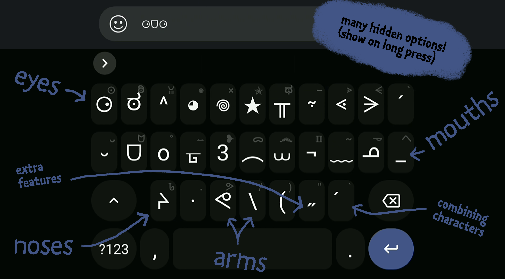

# Emoticon Keyboard for Android

Typing emoticons and kaomojis was never that easy! Available *for free* to every Android user.

## Description

- Dedicated keys for particular emoticon features.
- Be creative! There are endless possibilities with this keyboard.
- Based on [HeliBoard](https://github.com/Helium314/HeliBoard)
- Here a short showcase gif:

## Installation

### Quick installation (if you have never used HeliBoard before)

1. Download `emoticon_keyboard.zip` to your Android device.
2. Install HeliBoard by installing the apk file [available here](https://github.com/Helium314/HeliBoard/releases). 
   **Alternative:** Install [F-Droid](https://f-droid.org/) and then install [HeliBoard](https://f-droid.org/packages/helium314.keyboard/) using F-Droid.
4. Activate HeliBoard in the Android settings, following HeliBoard’s instructions.
5. In the HeliBoard settings, go to `Advanced` and select `Backup and restore`.
6. In the pop-up, press on `Restore` and select the downloaded `emoticon_keyboard.zip`.

You’re done! If you get errors, try the manual installation.

### Manual installation

1. Download `emoticon_keyboard.txt`, `emoticon_symbols.txt` and `emoticon_more_symbols.txt` to your Android device.
2. If not already done, install HeliBoard as described above (Quick installation 2.–3.).
3. In the HeliBoard Settings, go to `Secondary layouts`, select `Symbols`, press `Load file` and select the downloaded `emoticon_symbols.txt`
4. Press `close`, then select `More symbols`, press `Load file` and select the downloaded `emoticon_more_symbols.txt`
5. Go back to the main menu, select `Languages & Layouts`, scroll down and switch on “No language”.
6. You should now see the editing interface for your new layout. In the `Secondary layouts` section, select `emoticon_symbols` for “Symbols” and `emoticon_more_symbols` for “More symbols”.
7. Press on the `+` sign in the `Layout` section and select `Load file`.
8. Select the downloaded `emoticon_keyboard.txt`.

You’re done! Feel free to play around with all the other HeliBoard settings.
